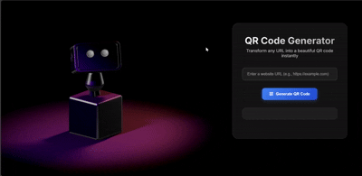

# QR Code Generator

A modern, interactive **QR Code Generator** that transforms any URL into a beautiful QR code instantly. The project features a sleek design with a 3D robot animation for an engaging user experience.

## 🔗 Live Demo

[Check it out here](https://qr-code-genarator-fawn.vercel.app/)

## 🛠 Features

- Generate QR codes from any valid URL.
- Click on the QR code to download it as a PNG.
- Responsive design for mobile, tablet, and desktop.
- Modern glassmorphism UI with gradients and smooth animations.
- Interactive 3D robot background using Spline.
- Footer with social links, navigation, and copyright.

## ⚡ Technologies Used

- **HTML5 & CSS3**: Structure and styling
- **JavaScript**: QR code generation & interactivity
- **[QRCode.js](https://github.com/soldair/node-qrcode)**: QR code generation library
- **[Spline](https://spline.design/)**: 3D robot animation
- **Google Fonts**: Inter font
- **Font Awesome**: Icons for buttons and social links

## 📝 Usage

1. Enter a URL in the input box (e.g., `https://example.com`).
2. Click **Generate QR Code**.
3. Click on the generated QR code to download it or use the **Download QR Code** button.

## 📱 Responsive Design

The interface adapts to all screen sizes:

- Desktop & laptop
- Tablets
- Mobile devices (portrait & landscape)

## 🌟 Future Improvements

- Customize QR code color and size.
- Add error correction levels.
- Store QR codes for quick access.
- Dark/light mode toggle.

